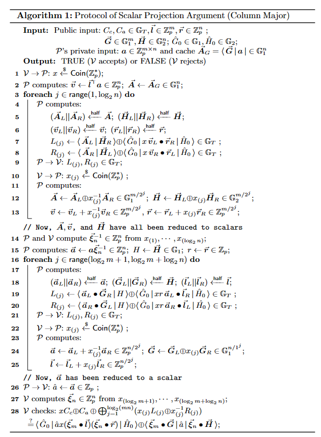

# zkMatrix: Conquering Zero-Knowledge Proof for Large Matrix Multiplication

This folder contains codes for our paper
*Pairing-Based zkMatrix: Conquering Zero-Knowledge Proof for Large Matrix Multiplication*.

## Overview

Given a pairing
$e: \mathbb{G}_1 \times \mathbb{G}_2 \mapsto \mathbb{G}_T$, 
and two vectors 
$\hat{\mathbf{G}} \in \mathbb{G}_1^{q-1}$ 
and 
$\hat{\mathbf{H}} \in \mathbb{G}_2^{q-1}$,

then the two-tier commitment $C_a \in \mathbb{G}_T$ for a $m \times n$ ( $m,n \le q-1$ ) matrix 

$\mathbf{a} = \lbrace a_{ij} \rbrace \in \mathbb{Z}_p^{m\times n}$ is defined by:

$$
\langle \hat{\mathbf{G}}  |  \mathbf{a}   |  \hat{\mathbf{H}} \rangle
: = \bigoplus_{i=1}^m \bigoplus_{j=1}^n a_{ij} e(G_i, H_j).
$$ 

Suppose the prover has made commitments to three $m \times n$ matrix 
$\mathbf{a}$, $\mathbf{b}$, and $\mathbf{c}$ as follows:

$$ 
C_a = \langle \hat{\mathbf{G}}  |  \mathbf{a}   |  \hat{\mathbf{H}} \rangle 
\in \mathbb{G}_T, 
$$

$$
C_b =  \langle \hat{\mathbf{G}}  |  \mathbf{b}   |  \hat{\mathbf{H}} \rangle 
\in \mathbb{G}_T,
$$

$$
C_c =  \langle \hat{\mathbf{G}}  |  \mathbf{c}  |  \hat{\mathbf{H}} \rangle
\in \mathbb{G}_T .
$$

Then, the prover can generate a zero-knowledge proof with $O(m+n+l)$ group operations
for the relation:

$$
\mathcal{R} = \lbrace
     C_c \in \mathbb{G}_T, C_a \in \mathbb{G}_T, C_b \in \mathbb{G}_T;
    \hat{\mathbf{G}} \in \mathbb{G}_1^{q} , \hat{\mathbf{H}} \in \mathbb{G}_2^{q} 
$$

$$
: \mathbf{a} \in \mathbb{Z}_p^{m\times l},
    \mathbf{b} \in \mathbb{Z}_p^{l \times n},
    \mathbf{c} \in \mathbb{Z}_p^{m \times n}
$$

$$
| \mathbf{c} = \mathbf{a} \mathbf{b} 
    \wedge C_c =
     \langle \hat{\mathbf{G}}  |  \mathbf{c}   |  \hat{\mathbf{H}} \rangle
    \wedge C_a =
     \langle \hat{\mathbf{G}}  |  \mathbf{a}   |  \hat{\mathbf{H}} \rangle
    \wedge C_b =
     \langle \hat{\mathbf{G}}  |  \mathbf{b}   |  \hat{\mathbf{H}} \rangle     
\rbrace.
$$

We employ the random oracle approach.

For more details, refer to the math in our paper. 

## Subprotocols

DualMatrix contains four subprotocols:
- Scalar projection argument
- Left projection argument
- Right projection argument
- Inner product argument in $$\mathbb{G}_T$$

The scalar projection argument, for example, is for the following relation:

$$
\mathcal{R} = \lbrace
     C_c \in \mathbb{G}_T, C_a \in \mathbb{G}_T, 
     \hat{\mathbf{l}} \in \mathbb{Z}_p^{m}, \hat{\mathbf{r}} \in \mathbb{Z}_p^{n};
     \hat{G}_0 \in \mathbb{G}_1, \hat{H}_0 \in \mathbb{G}_2,
    \hat{\mathbf{G}} \in \mathbb{G}_1^{q-1} , \hat{\mathbf{H}} \in \mathbb{G}_2^{q-1} 
$$

$$
: \mathbf{a} \in \mathbb{Z}_p^{m \times n}
$$

$$
|   C_c =
     \langle \hat{G}_0  |  \hat{\mathbf{L}}^T\mathbf{a} \hat{\mathbf{r}}  |  \hat{H}_0 \rangle
    \wedge C_a =
     \langle \hat{\mathbf{G}}  |  \mathbf{a}   |  \hat{\mathbf{H}} \rangle 
\rbrace.
$$

The pseudo-code for this subprotocol is as follows:



### Running the Code

To run the experiment in the DualMatrix paper, run the following command:
```bash
cd /path/to/zkmatrix
cargo bench
```

## Compatibility Note

- **Rust Toolchain:** 3.10.12
- **Environment:** Ubuntu 22.04


## Directory Contents

- **util/** Utility functions for Fiat-Shamir transformation, matrix projections, and inner products.
- **protocols/** The MatMul protocol and its sub-protocols.
- **zkprotocols/** The zero-knowledge MatMul protocol and its sub-protocols.

--- 

## Citing

If our work benefits to your research, please cite our paper as follows:

