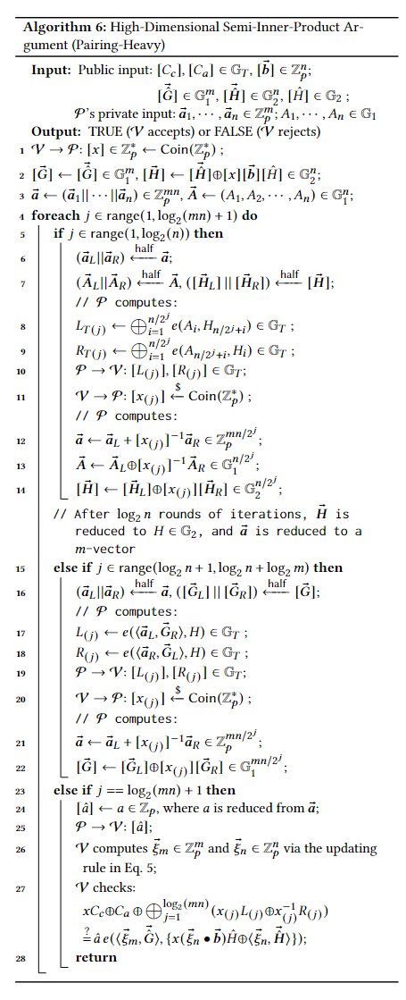

# Conquering Large Zero-Knowledge Proof for Large Matrix Multiplication



---

## Introduction 

## Getting Started

### Running the Code

To execute our program, run the following command:
```bash
cd /path/to/zkmatrix
cargo run
```

## Compatibility Note

- **Rust Toolchain:** 3.10.12
- **Environment:** Ubuntu 22.04

---

## Algorithms

### Matrix Commitment

### Inner-Product Argument

### Semi-Inner-Product Argument

### High-Dimensional Semi-Inner-Product Argument

### Protocol MatMul

---

## Directory Contents

- **lib.rs:** The primary entry point for the program.
- **util/** Utility functions.
- **op/** Zero-knowledge proofs for various matrix oprators.

For more

--- 

## Citing

If our work benefits to your research, please cite our paper as follows:

This is math in README file:

$$ \sqrt{\mathbf{x}}$$